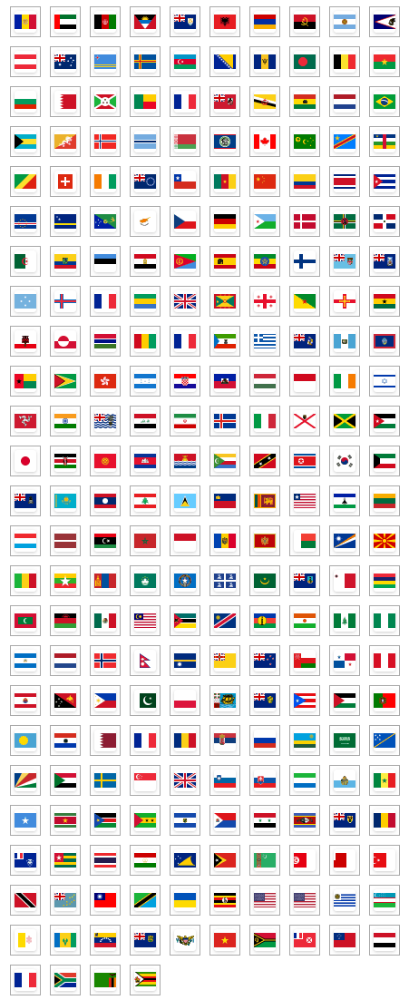

# FM Flag Archive

This repository is a archive of the country flag png icons provided by **Blogging.com** from [this blog post](https://web.archive.org/web/20211024034859/https://blogging.com/free-flag-icons/) posted by **Natalie Mootz**, alongside extending custom flags utilized on [flockmod.com](https://flockmod.com/).

File naming follows the [ISO 3166-1 alpha-2](https://en.wikipedia.org/wiki/ISO_3166-1_alpha-2) specification.

**Notes**: 
- The original readme.txt from the blogpost specifies the flags to be free with attribution. For further information read the original readme.txt.

- Images have been optimized using [oxipng](https://github.com/shssoichiro/oxipng), lossless compression and meta-data stripping were applied:
 >oxipng -o max --strip safe --alpha *.png

**Disclaimer!** All rights reserved to the respective copyright owners.

---
### Known Issues
The original blog post is missing flags for the following offcially assigned country codes as of 05.11.2024: **[AQ](https://commons.wikimedia.org/wiki/File:Proposed_flag_of_Antarctica_(Graham_Bartram).svg) [EH](https://commons.wikimedia.org/wiki/File:Flag_of_the_Sahrawi_Arab_Democratic_Republic_(3-2).svg) [HM](https://commons.wikimedia.org/wiki/File:Flag_of_Australia_(3-2).svg) [MF](https://commons.wikimedia.org/wiki/File:Flag_of_France.svg) [SJ](https://commons.wikimedia.org/wiki/File:Flag_of_Norway_(c81329_for_red_%26_14275b_for_blue).svg)**. (Missing flags can be found in the fixes folder)

The **[TN](https://commons.wikimedia.org/wiki/File:Flag_of_Tunisia.svg) [TO](https://commons.wikimedia.org/wiki/File:Flag_of_Tonga_(3-2).svg) [TR](https://commons.wikimedia.org/wiki/File:Flag_of_Turkey.svg)** flags have a significant offset to the left, causing the specified flags to appear clipped. (Replacements can be found in the fixes folder)

---
### License
This work is licensed under a
[Creative Commons Attribution 4.0 International License][cc-by].

[![CC BY 4.0][cc-by-shield]][cc-by]

[cc-by]: http://creativecommons.org/licenses/by/4.0/
[cc-by-shield]: https://img.shields.io/badge/License-CC%20BY%204.0-lightgrey.svg